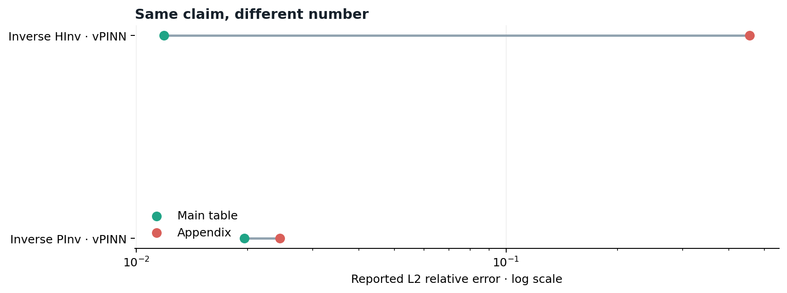
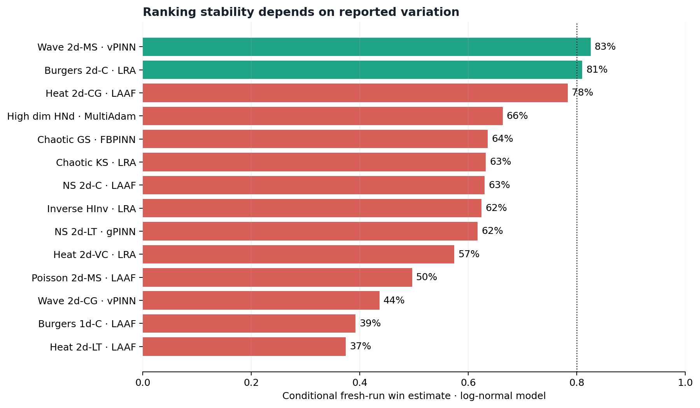
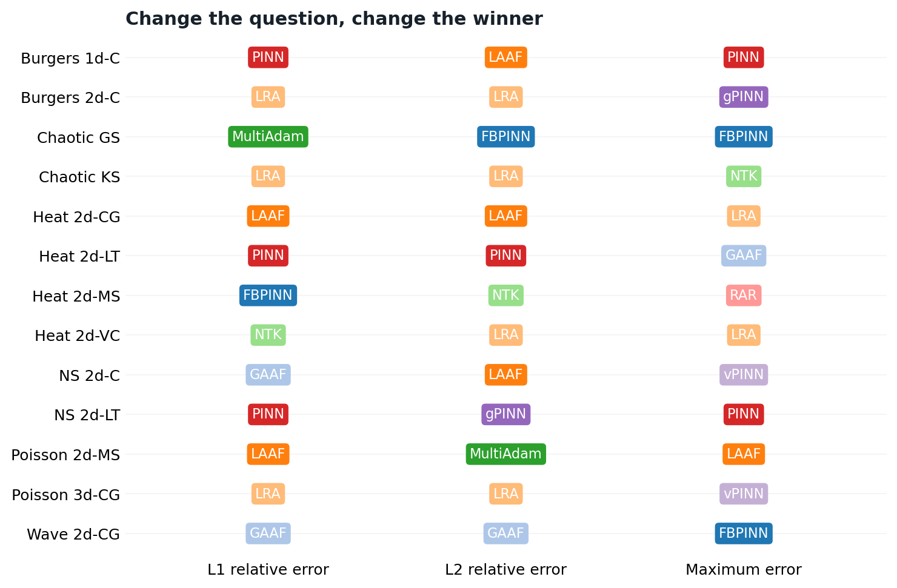
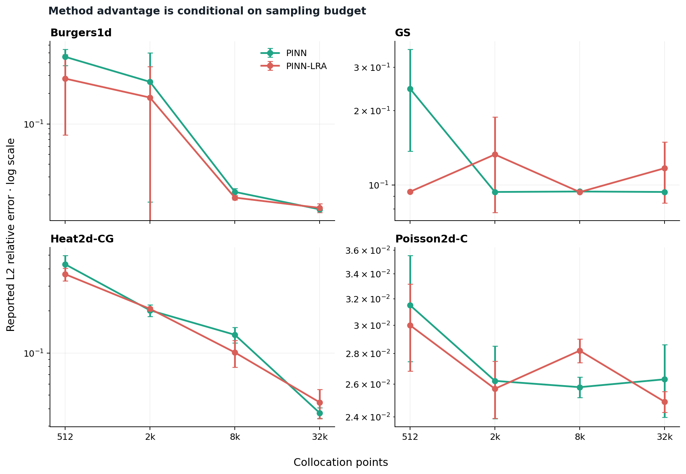

# When the Winner Changes

[](https://github.com/sinemsalvaersoy/when-the-winner-changes/actions/workflows/ci.yml)

## A reliability audit of PINN benchmarks

A benchmark reports a winner. This project asks whether the winner survives contact with the benchmark's own evidence.

PINN methods are often compared through a compact leaderboard, but a rank can change when the source table changes, a stochastic run is repeated, or the definition of error changes. This repository turns those possibilities into an executable audit.

> Agreement is evidence. Sometimes it is evidence about the limits of the test.

## What this project audits

The first case study examines the published results of [PINNacle](https://arxiv.org/abs/2306.08827), a benchmark spanning 22 PDE cases and multiple PINN variants.

The audit asks four questions:

1. Are identical claims numerically consistent across the main paper and appendix?
2. Under explicit distribution assumptions, how stable is the reported ranking on a simulated fresh run?
3. Does the winner survive a change from global relative error to worst-case error?
4. Which causal explanations for a rank change are supported by the available evidence, and which require new experiments?

## Headline result

The audit finds that the HInv vPINN L2 relative error is reported as **0.0119** in the main table and **0.456** in the detailed appendix. The 38.3× discrepancy reverses the winning method for that case and changes which result supports the associated comparison.

This is a reporting inconsistency, not evidence that either value is correct. Resolving it requires raw per-seed outputs or author confirmation.

Across the full audit:

* 235 shared L2RE claims are checked across the two source tables
* 2 numerical conflicts are found
* 12 of 22 cases fall below a diagnostic 80% conditional ranking-stability threshold under the log-normal model
* 13 of 22 PDE cases select different winners when the error definition changes
* all 4 published collocation ablations change winners as the sampling budget changes
* the most likely winner is unchanged across three distribution models in all 22 cases, while probability magnitudes move by as much as 21 percentage points









The complete evidence trail is in [`results/AUDIT_REPORT.md`](results/AUDIT_REPORT.md). The project distinguishes source inconsistency, stochastic instability, and metric dependence rather than collapsing them into one failure label.

The second-stage [`results/MECHANISM_AUDIT.md`](results/MECHANISM_AUDIT.md) asks why a winner changes. It converts optimization-basin sensitivity, collocation overfitting, and physical-invariant failure into falsifiable experiments while marking them `not identifiable` from aggregate benchmark tables alone.

The paired rerun extension is specified in [`docs/RERUN_PROTOCOL.md`](docs/RERUN_PROTOCOL.md). It pins the upstream code, defines paired seed and collocation blocks, rejects incomplete comparisons, and separates rank switching from residual generalization gaps before GPU evidence is admitted into the audit.

## Quick start

```bash
python -m venv .venv
source .venv/bin/activate
pip install -e ".[dev]"
pinn-audit
pytest -q
```

To regenerate the versioned dataset directly from the public arXiv source:

```bash
pinn-audit --extract
```

## Outputs

`source_consistency.csv` records every comparable main-text and appendix claim.

`winner_probabilities.csv` reports conditional log-normal fresh-run simulations from published three-run summaries.

`distribution_sensitivity.csv` shows how those estimates change under log-normal, nonnegative-normal, and gamma assumptions.

`metric_sensitivity.csv` shows whether the winner changes across L2RE, L1RE, and maximum error.

`mechanism_evidence.csv` separates observed dependencies from causal explanations that still require interventions or raw run-level data.

The figures are generated from the same tabular outputs used in the report.

## Why this is not another leaderboard

The unit of analysis is the inference from result to claim, not only the model score. A lower mean error can coexist with an assumption-sensitive rank. A global metric can hide a poor worst-case region. A polished main table can disagree with its detailed evidence.

The framework therefore keeps five layers separate:

\[
\text{source} \quad | \quad \text{rerun} \quad | \quad \text{metric} \quad | \quad \text{budget} \quad | \quad \text{mechanism}
\]

See [`docs/METHODOLOGY.md`](docs/METHODOLOGY.md) for assumptions and limits.

## Scope and attribution

PINNacle belongs to its original authors. This independent audit uses numerical facts extracted from the versioned arXiv source and cites the benchmark rather than redistributing its manuscript. A flag is a request for resolution, not an allegation.

## Author

Dr. Sinem Şalva Ersoy  
Experimental particle physicist working on scientific AI, representation, inference, and model reliability.
