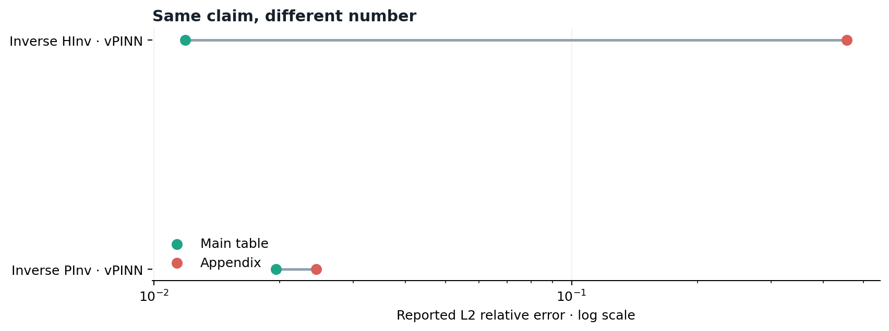
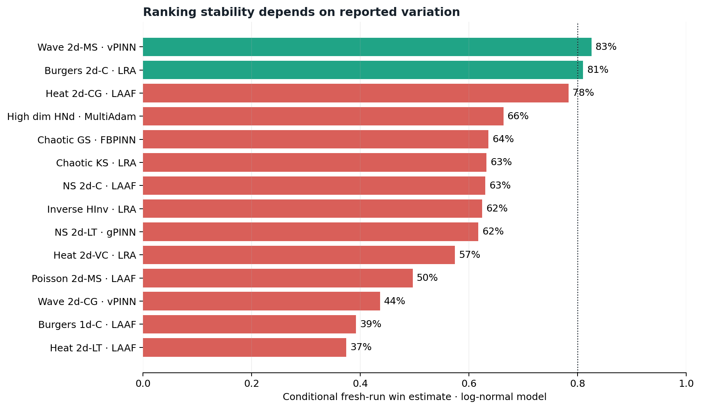
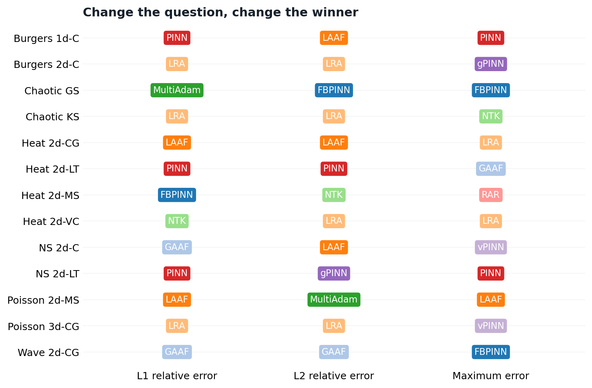
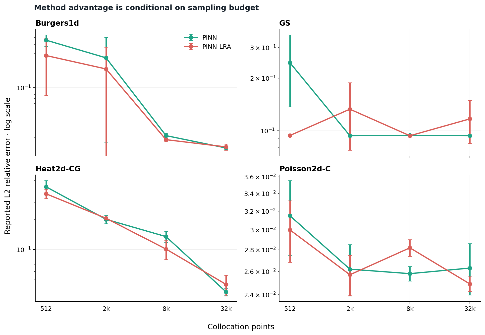
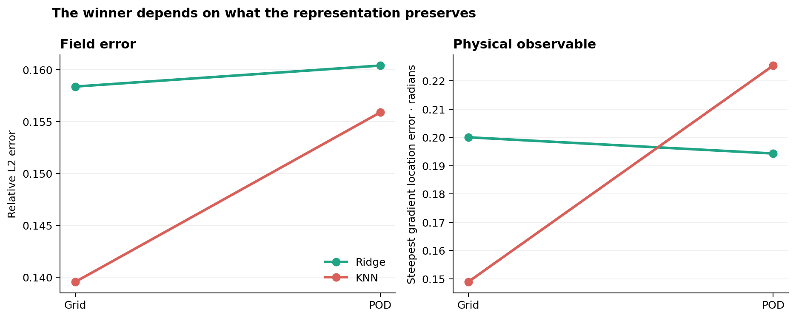
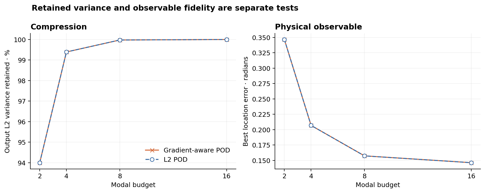
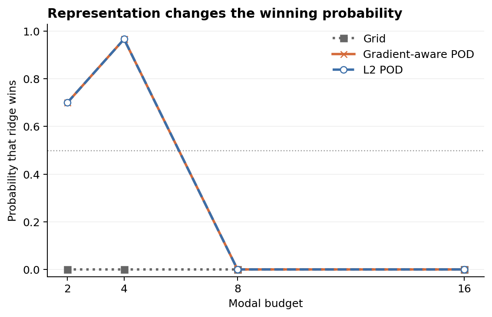
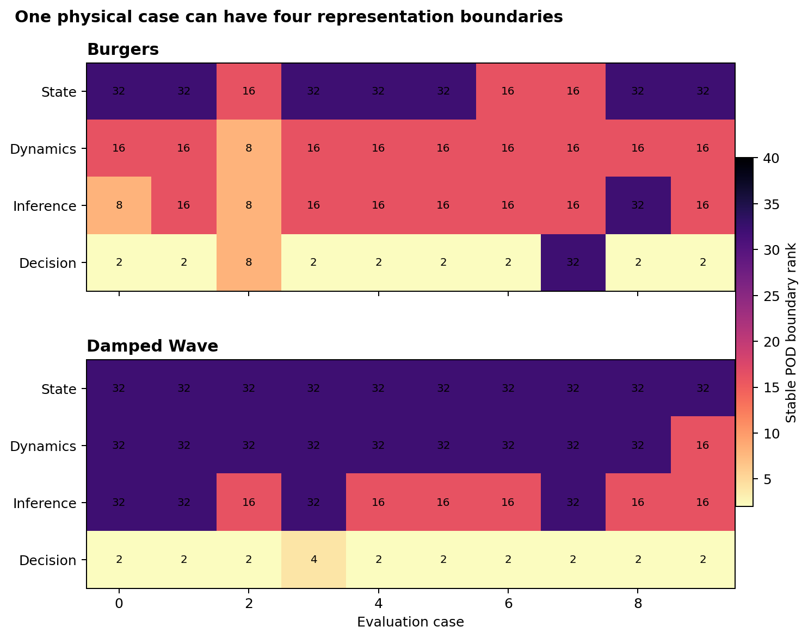
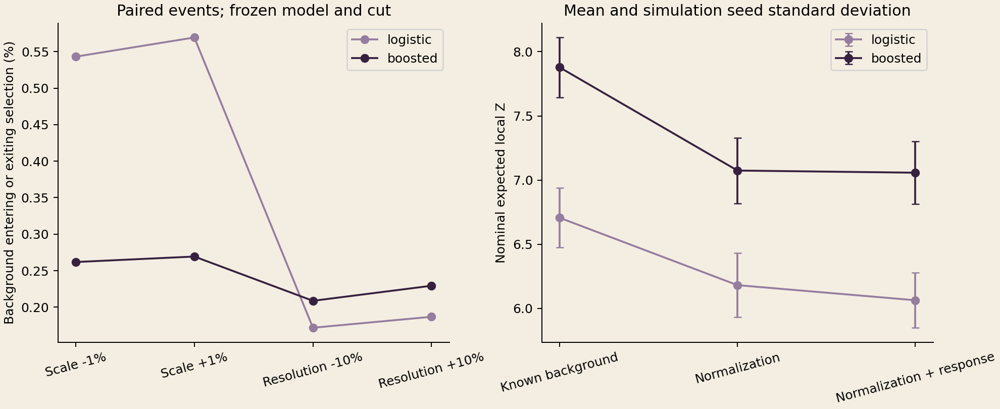

# When the Winner Changes

[](https://github.com/sinemsalvaersoy/when-the-winner-changes/actions/workflows/ci.yml)

## A reliability audit of PINN benchmarks

A benchmark reports a winner. This project asks whether the winner survives contact with the benchmark's own evidence.

PINN methods are often compared through a compact leaderboard, but a rank can change when the source table changes, a stochastic run is repeated, or the definition of error changes. This repository turns those possibilities into an executable audit.

> Agreement is evidence. Sometimes it is evidence about the limits of the test.

## What this project audits

The first case study examines the published results of [PINNacle](https://arxiv.org/abs/2306.08827), a benchmark spanning 22 PDE cases and multiple PINN variants.

The audit asks four questions:

1. Are identical claims numerically consistent across the main paper and appendix?
2. Under explicit distribution assumptions, how stable is the reported ranking on a simulated fresh run?
3. Does the winner survive a change from global relative error to worst-case error?
4. Which causal explanations for a rank change are supported by the available evidence, and which require new experiments?

## Headline result

The audit finds that the HInv vPINN L2 relative error is reported as **0.0119** in the main table and **0.456** in the detailed appendix. The 38.3× discrepancy reverses the winning method for that case and changes which result supports the associated comparison.

This is a reporting inconsistency, not evidence that either value is correct. Resolving it requires raw per-seed outputs or author confirmation.

Across the full audit:

* 235 shared L2RE claims are checked across the two source tables
* 2 numerical conflicts are found
* 12 of 22 cases fall below a diagnostic 80% conditional ranking-stability threshold under the log-normal model
* 13 of 22 PDE cases select different winners when the error definition changes
* all 4 published collocation ablations change winners as the sampling budget changes
* the most likely winner is unchanged across three distribution models in all 22 cases, while probability magnitudes move by as much as 21 percentage points









The complete evidence trail is in [`results/AUDIT_REPORT.md`](results/AUDIT_REPORT.md). The project distinguishes source inconsistency, stochastic instability, and metric dependence rather than collapsing them into one failure label.

The second-stage [`results/MECHANISM_AUDIT.md`](results/MECHANISM_AUDIT.md) asks why a winner changes. It converts optimization-basin sensitivity, collocation overfitting, and physical-invariant failure into falsifiable experiments while marking them `not identifiable` from aggregate benchmark tables alone.

The paired rerun extension is specified in [`docs/RERUN_PROTOCOL.md`](docs/RERUN_PROTOCOL.md). It pins the upstream code, defines paired seed and collocation blocks, rejects incomplete comparisons, and separates rank switching from residual generalization gaps before GPU evidence is admitted into the audit.

## Controlled representation pilot

The repository now moves from retrospective audit to a small intervention on the viscous Burgers equation. The same trajectories and learners are evaluated on the full spatial grid and a four mode POD encoding.

KNN wins under relative L2 error in both representations. For the location of the steepest gradient, KNN wins on the grid and ridge wins after POD compression. The change appears across all three paired data seeds even though four POD modes retain more than 99.3 percent of output variance.



This is a bounded mechanism result, not a universal claim about POD. The design, exact controls, interpretation boundary, and raw outputs are documented in [`docs/BURGERS_REPRESENTATION_PILOT.md`](docs/BURGERS_REPRESENTATION_PILOT.md).

## Representation robustness extension

The pilot is now tested across ten paired seeds, spatial grids of 64, 128, and
256 points, and modal budgets of 2, 4, 8, and 16. The original four-mode result
survives: KNN wins the steepest-gradient location metric on the full grid in
30 of 30 paired seed-resolution blocks, while ridge wins after four-mode POD in
29 of 30.

The sweep also locates the boundary of the effect. At eight and sixteen modes,
the reversal disappears and KNN wins again. Four modes retain about 99.39
percent of output variance on average, while eight retain about 99.98 percent.
High retained variance therefore does not identify the modal budget at which a
local observable or its model ranking becomes stable.





The complete design, bootstrap intervals, negative gradient-aware control, and
interpretation boundary are in
[`docs/BURGERS_REPRESENTATION_ROBUSTNESS.md`](docs/BURGERS_REPRESENTATION_ROBUSTNESS.md).

## Representation boundary audit

The next experiment asks how much representational capacity is required for
four different purposes. Across viscous Burgers and a damped-wave family, it
extracts separate case-level boundaries for state reconstruction, forward
dynamics, parameter inference, and an operational decision.

The primary boundary is the first POD rank that passes its prespecified rule and
continues to pass at every larger tested rank. Temporary passes, later failures,
and unresolved cases remain visible rather than being forced into a monotone
story.

In the versioned run, median state boundaries are rank 32 in both PDE families.
Median dynamics boundaries are rank 16 for Burgers and rank 32 for damped wave;
median inference boundaries are rank 16 for both. Most binary decisions remain
unchanged at rank 2, but one Burgers boundary case requires rank 32 even though
its state and dynamics stabilize at rank 16. Decision preservation is therefore
neither implied by field fidelity nor ordered uniformly after it.



The paired-noise design, calibration split, exact-subspace control, thresholds,
and interpretation limits are documented in
[`docs/REPRESENTATION_BOUNDARY_AUDIT.md`](docs/REPRESENTATION_BOUNDARY_AUDIT.md).

## Synthetic discovery sensitivity pilot

A separate [particle physics mechanism pilot](examples/discovery_sensitivity/README.md)
compares classifier ROC AUC with expected local discovery sensitivity in a synthetic
resonance search. Its [event-level detector extension](examples/discovery_sensitivity/DETECTOR_RESPONSE.md)
propagates paired scale and resolution changes through frozen classifiers and cuts,
records selection migrations, and profiles detector-derived background templates.

The prespecified runs do **not** produce a ranking reversal. Boosting remains more
sensitive, while the ordering of gross selection migration changes between scale
and resolution variations. These are bounded synthetic findings, not calibrated
detector performance. Profile range restrictions and the boundary fit are documented.



## Quick start

```bash
python -m venv .venv
source .venv/bin/activate
pip install -e ".[dev]"
pinn-audit
pytest -q
```

Run the larger paired representation sweep explicitly:

```bash
pinn-audit --robustness
```

Extract the cross-PDE preservation boundaries:

```bash
pinn-audit --boundaries
```

To regenerate the versioned dataset directly from the public arXiv source:

```bash
pinn-audit --extract
```

## Outputs

`source_consistency.csv` records every comparable main-text and appendix claim.

`winner_probabilities.csv` reports conditional log-normal fresh-run simulations from published three-run summaries.

`distribution_sensitivity.csv` shows how those estimates change under log-normal, nonnegative-normal, and gamma assumptions.

`metric_sensitivity.csv` shows whether the winner changes across L2RE, L1RE, and maximum error.

`mechanism_evidence.csv` separates observed dependencies from causal explanations that still require interventions or raw run-level data.

The figures are generated from the same tabular outputs used in the report.

## Why this is not another leaderboard

The unit of analysis is the inference from result to claim, not only the model score. A lower mean error can coexist with an assumption-sensitive rank. A global metric can hide a poor worst-case region. A polished main table can disagree with its detailed evidence.

The framework therefore keeps five layers separate:

\[
\text{source} \quad | \quad \text{rerun} \quad | \quad \text{metric} \quad | \quad \text{budget} \quad | \quad \text{mechanism}
\]

See [`docs/METHODOLOGY.md`](docs/METHODOLOGY.md) for assumptions and limits.

## Scope and attribution

PINNacle belongs to its original authors. This independent audit uses numerical facts extracted from the versioned arXiv source and cites the benchmark rather than redistributing its manuscript. A flag is a request for resolution, not an allegation.

## Author

Dr. Sinem Şalva Ersoy  
Experimental particle physicist working on scientific AI, representation, inference, and model reliability.
