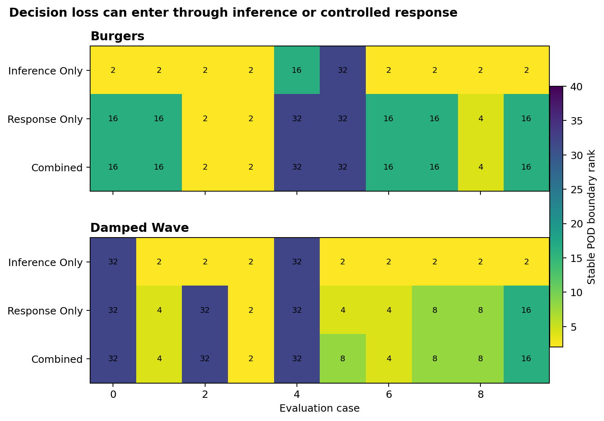

# Action-conditioned decision audit

## Research question

A representation can preserve an observed state and still fail when the state
is used to choose an intervention. The missing test is counterfactual: for each
available action, does the representation preserve the physical quantity that
enters the loss?

This audit asks whether a POD representation preserves the action selected by a
paired full-grid conditional oracle under controlled forcing. It then separates
two possible causes of decision change:

1. the representation changes the parameter posterior
2. the representation changes the predicted response to an action

The combined pathway changes both. Without this decomposition, a decision
disagreement cannot be attributed to inference or control-response error.

## Physical interventions

The action set has three ordered levels: no control, moderate control, and
strong control.

For viscous Burgers, the post-observation dynamics receive proportional
mean-preserving body-force feedback

\[
u_t + u u_x = \nu u_{xx} - g\bigl(u-\bar u\bigr).
\]

For the damped wave, active velocity feedback increases dissipation after the
last observation

\[
u_{tt}+2\gamma u_t-u_{xx}=-2g u_t.
\]

The controller is activated only after the observation window. The parameter
posterior is therefore inferred from the same uncontrolled measurements for
all candidate actions.

## Action-conditioned quantity and loss

For every parameter candidate \(\theta_j\) and action \(a\), the simulator
produces a future quantity of interest \(Q(\theta_j,a)\). Burgers uses the
magnitude of the steepest negative gradient. The damped wave uses absolute
displacement at the fixed sensor near three quarters of the domain.

The synthetic operational loss is

\[
L(a,\theta_j)=
\left[\max\left(\frac{Q(\theta_j,a)}{q_*}-1,0\right)\right]^2+c_a.
\]

The action minimizes posterior expected loss. The hazard tolerance \(q_*\) is
set exclusively from separate calibration cases. The Burgers tolerance is the
calibration median and the wave tolerance is the calibration lower quartile.
Action costs are fixed in the versioned specification file.

These utilities are controlled synthetic design choices, not estimates of real
engineering costs. They create an explicit decision problem whose dependence
on representation can be audited. A deployment claim would require costs and
tolerances supplied by the application owner.

## Causal decomposition

| Pathway | Posterior | Action response |
|:--|:--|:--|
| Inference only | POD | Full grid |
| Response only | Full grid | POD reconstructed state |
| Combined | POD | POD reconstructed state |

Every rank uses the same cases and full-grid Gaussian noise draws. Regret is
always evaluated with the full-grid posterior and full-grid loss matrix. This
prevents a compressed representation from judging itself by its own altered
utility surface.

The stable boundary is the first tested POD rank that continues to satisfy all
three rules at every larger rank:

1. action disagreement no greater than 0.05
2. weaker-than-grid control rate no greater than 0.05
3. mean normalized full-grid regret no greater than 0.02

First passage, stable passage, and pass-then-fail order violations are retained
separately.

## Results

The audit contains two PDE families, ten evaluation cases per family, thirty
paired noise draws, six POD ranks, and three causal pathways. All sixty
case-pathway boundaries resolve by rank 32. Full-rank POD reproduces every
full-grid action and action-conditioned quantity to numerical precision.

| PDE family | Inference-only median | Response-only median | Combined median |
|:--|--:|--:|--:|
| Burgers | 2 | 16 | 16 |
| Damped wave | 2 | 8 | 8 |

The main result is not that a particular rank is universally adequate. It is
that posterior preservation and intervention-response preservation impose
different capacity requirements. In both PDE families the median combined
boundary follows the response-only boundary, not the inference-only boundary.
For these cases, the larger source of decision loss is the represented system's
counterfactual response to control.

The full-grid decision itself disagrees with the true-parameter best action in
7.0 percent of Burgers noise draws and 6.3 percent of damped-wave draws. The
grid is therefore a conditional representation-preservation oracle, not a
perfect decision maker.

Four cases, forming eight case-pathway pairs, show a pass-then-fail event before
stable recovery: Burgers case 9 and damped-wave cases 2, 7, and 9 in both the
response-only and combined pathways. Increasing rank is not treated as an
empirical monotonicity guarantee.



## Limitations

The controllers are simple feedback laws, the action set is discrete, the
parameter prior is uniform on a small grid, and the noise model is Gaussian.
The POD basis is trained on uncontrolled calibration trajectories. The result
therefore tests whether an observational representation transfers to
post-intervention dynamics; it does not test a basis trained on controlled
trajectories.

The next discriminating experiment is to compare this observational POD basis
with an action-aware basis trained on calibration interventions. If the
response boundary moves while inference remains fixed, the change can be
attributed to representation support rather than more observational data.

## Run

```bash
pinn-audit --actions
```

The command writes aggregate metrics, paired noise-draw decisions, stable
boundaries, the fixed specification, and the principal figure to `results/`.
