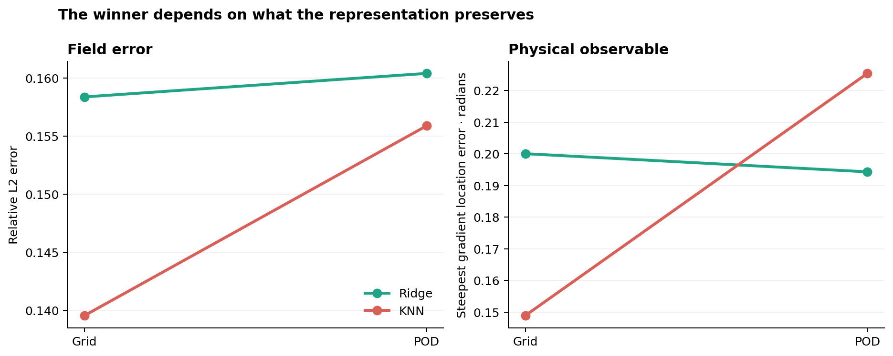

# Burgers representation pilot

## Question

Does a model comparison survive a change from the full spatial grid to a compact POD encoding when the physical trajectories, learners, train and test split, and evaluation rules remain paired?

## Experiment

The data are numerical solutions of the periodic viscous Burgers equation

\[
u_t + u u_x = \nu u_{xx}, \qquad \nu = 0.03.
\]

Smooth initial conditions contain a random phase, amplitude, and second harmonic. A Fourier spatial discretisation and fourth order Runge Kutta time integration evolve each state to time 0.30. The task is to predict the evolved state from its initial state.

Two deliberately transparent learners are used: linear ridge regression and three nearest neighbours. They are evaluated on the full 64 point grid and on a four mode POD encoding. The initial conditions lie in a four dimensional generating family, so four input modes retain effectively all training variance. Four output modes retain between 99.31 and 99.44 percent across the three paired data seeds.

| Factor | Status | Value |
|:--|:--|:--|
| Physical equation | Fixed | Periodic viscous Burgers equation |
| Viscosity | Fixed | 0.03 |
| Time horizon | Fixed | 0.30 |
| Spatial resolution | Fixed | 64 points |
| Train and test samples | Fixed | 140 and 80 |
| Data seeds | Paired | 11, 17, 23 |
| Learners | Fixed | Linear ridge and three nearest neighbours |
| Encoding | Changed | Full grid or four mode POD |
| Evaluation | Fixed | Relative L2 and steepest gradient location error |

## Result

KNN has the lowest mean relative L2 error under both encodings. The physical diagnostic tells a different story. KNN best preserves the steepest gradient location on the full grid, while ridge is better after POD compression.

| Representation | L2 winner | Location winner |
|:--|:--|:--|
| Grid | KNN | KNN |
| POD | KNN | Ridge |

The reversal is visible for the steepest gradient location under each of the three paired seeds. It is therefore not the product of selecting one favourable split from this preregistered seed set.

## Interpretation boundary

This pilot identifies a mechanism worth testing, not a general law. It uses two simple learners, one POD dimension, one family of initial conditions, and a moderate viscosity. The steepest gradient location is a physically interpretable diagnostic, not a claim that the solution contains a discontinuous shock.

The result supports one narrow conclusion: preserving more than 99 percent of output variance does not guarantee preservation of the model ranking for a local physical feature. Broader claims require variation of viscosity, modal budget, initial condition family, and learning method.

All reported values are regenerated by `pinn-audit`. Raw paired runs, aggregate results, and the controlled conditions are stored as CSV files in `results`.
